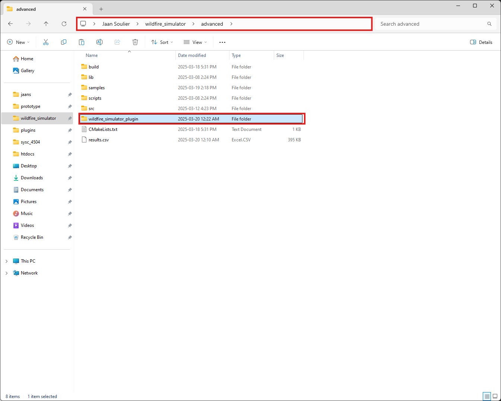
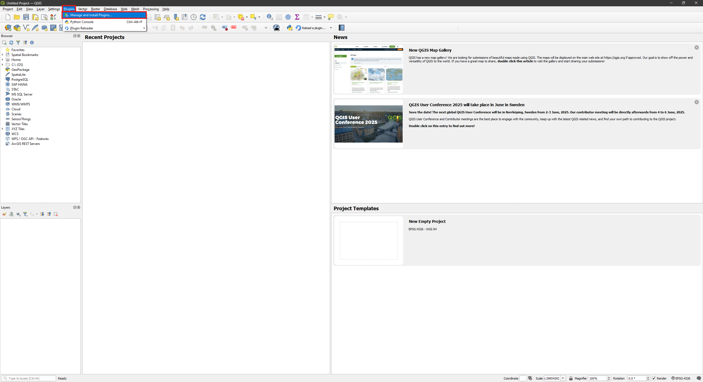
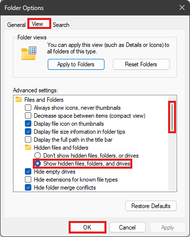

# Wildfire Simulator

Table of Contents
1. [Installation Intructions](#1-installation-instructions)
    1. [Windows](#11-windows)
        1. [Git](#111-git)
        2. [Visual Studio](#visual_studio_-visual-studio)
        3. [QGIS (Advanced)](#qgis_-qgis-advanced)
    2. [Linux](#12-linux)
        1. [Debian-based](#121-debian-based)
        2. [Other](#122-other)
2. [Building the Wildfire Simulator](#2-building-the-wildfire-simulator)
    1. [Basic Model](#21-basic-model)
    2. [Advanced Model](#22-advanced-model)
        1. [CMake Options](#221-cmake-options)
    3. [VSCode](#23-vscode)
3. [Using the Wildfire Simulator](#3-using-the-wildfire-simulator)
    1. [Basic Model](#31-basic-model)
    2. [Advanced Model](#32-advanced-model)
        1. [Using the CLI](#321-using-the-cli)
            1. [Viewing the Results](#3211-viewing-the-results)
        2. [Preparing Maps](#322-preparing-maps)
        3. [Installing the Plugin](#323-installing-the-plugin)
        4. [Simulating](#324-simulating)
4. [Other](#4-other)
    1. [Enabling Hidden Folders on Windows](#41-enabling-hidden-folders-on-windows)

## 1. Installation Instructions

The wildfire simulator requires several dependencies:
- Git
- C++ compiler
- CMake
- QGIS (advanced model)

For detailed instructions on installing these dependencies, please navigate to the platform-specific installation section.

### 1.1 Windows

#### 1.1.1 Git

1. In your browser of choice, enter and navigate to the following link: https://git-scm.com/downloads

2. Click on the Windows download button


3. Click on the 64-bit Git for Windows setup button


4. Run the Git installer located in your Downloads folder (double-click on the file)


5. Click Next in the installer window


6. Click Next in the installer window (optionally change the installation path)


7. Click Next in the installer window (optionally check additional options)


8. Click Next in the installer window


9. Click Next in the installer window (optionally change your editor preference)


10. Click Next in the installer window (optionally change your default branch name)


11. Click Next in the installer window


12. Click Next in the installer window


13. Click Next in the installer window


14. Click Next in the installer window


15. Click Next in the installer window


16. Click Next in the installer window


17. Click Next in the installer window


18. Click Install in the installer window


19. Click Finish in the installer window


#### 1.1.2 Visual Studio

1. Navigate to the following link and download the Community edition of Visual Studio: https://visualstudio.microsoft.com/downloads/


2. When the download finishes, run the installer and press "Continue"


3. Once the next download finishes, press "Modify"


4. Ensure "Desktop development with C++" is selected, then press "Install while downloading"


5. In the Windows search, type in "Environment Variables" and press "Edit the system environment variables"


6. Press "Environment Variables"


7. Under "System variables", press "Path" followed by "Edit"


8. Press "New" and enter the following path. Afterwards, press "Ok"
```
C:\Program Files\Microsoft Visual Studio\2022\Community\Common7\IDE\CommonExtensions\Microsoft\CMake\CMake\bin
```


9. Press "Ok"


10. Press "Ok"


11. To verify your installation, open a new shell and type "cmake". You should see something like the following


#### 1.1.3 QGIS (Advanced)

1. Navigate to the following link and click "Skip it and go to download": https://qgis.org/download/


2. Press "Long Term Version for Windows (3.40 LTR)"


3. When the download finishes, run the installer and press "Next"


4. Check "I accept the terms in the License Agreement" and press "Next"


5. Press "Next"


6. Press "Install"


7. Press on the administrative access icon and press "Yes"


7. Press "Finish"


9. To verify your installation, type in "QGIS" the Windows search. You should see something like the following


### 1.2 Linux

### 1.2.1 Debian-based

For Debian-based systems (Debian, Ubuntu, Linux-mint, etc), run the following command:

> NOTE: You must have sudo. If you do not, ask your Linux adminstrator for permissions or to install the packages

```bash
sudo apt-get install git cmake g++
```

### 1.2.2 Other

For other Linux distributions, refer to the package manager of your platform

> TODO: QGIS

## 2. Building the Wildfire Simulator

Open a Powershell or Bash instance.
Download the simulator to the directory of your choosing:

```
git clone https://github.com/jsoulier/wildfire_simulator --recurse-submodules
```

Navigate to the newly cloned directory

```
cd wildfire_simulator
```

You should see the following files:

```pwsh
$ ls -l
total 6008
drwxr-xr-x 1 jaans 197610       0 Mar  8 14:24 advanced/
drwxr-xr-x 1 jaans 197610       0 Mar  8 14:24 basic/
-rw-r--r-- 1 jaans 197610 5006260 Mar  8 14:24 cadmium_installation_manual.pdf
drwxr-xr-x 1 jaans 197610       0 Mar  8 14:24 doc/
-rw-r--r-- 1 jaans 197610 1045733 Mar  8 14:24 elevation_specification.pdf
-rw-r--r-- 1 jaans 197610   85387 Mar  8 14:24 land_specification.pdf
-rw-r--r-- 1 jaans 197610    3776 Mar  8 14:28 README.md
```

Proceed with the [basic](#21-basic-model) and/or [advanced](#22-advanced-model) model.

### 2.1 Basic Model

> TODO:

### 2.2 Advanced Model

### 2.2.3 Building

Navigate to the advanced directory

```pwsh
cd advanced
```

Create to folder to build from and enter that folder

```pwsh
mkdir build
cd build
```

Run the CMake generator. You should see output similar to the following (may vary based on platform)

```pwsh
cmake ..
```


Run the CMake build command. You should see output similar to the following (may vary based on platform).
You can safely ignore any warnings.

```pwsh
cmake --build .
```


You should now see the following files under `bin/`. (pdb is Windows debug builds only)

```pwsh
$ ls -l bin
total 12116
-rwxr-xr-x 1 jaans 197610  1455616 Mar  8 14:36 wildfire_simulator.exe*
-rw-r--r-- 1 jaans 197610 10948608 Mar  8 14:36 wildfire_simulator.pdb
```

#### 2.2.1 CMake Options

For better performance, you may want to produce a release mode build (with `-O3`).
With single-config generators (Makefiles, Ninja), use the following commands instead.

```pwsh
cmake .. -DCMAKE_BUILD_TYPE=Release
cmake --build .
```

With multi-config generators (Visual Studio, XCode), use the following commands instead.

```pwsh
cmake ..
cmake --build . --config Release
```

For faster build times, you can run a CMake build across multiple threads.
You can do this with the following option (and replace 8 with your desired number of threads).

```pwsh
cmake --build . --parallel 8
```

### 2.3 VSCode

For instructions on installing VSCode, see the [Cadmium Installation Manual](cadmium_installation_manual.pdf)

> TODO: Show how it can be easier to build through VSCode and CMake Tools

## 3. Using the Wildfire Simulator

### 3.1 Basic Model

### 3.2 Advanced Model

#### 3.2.1 Using the CLI

> TODO: Revisit when we add the slider for moisture parameters

The advanced model takes in JSON in the following schema:

```json
{
    "cells": {
        "default": {
            "delay": "inertial"
        },
        // coordinates
        "480478_5091045": {
            // coordinates of neighbouring cells
            "neighborhood": {
                "480428_5091073": 50,
                "480478_5091101": 50,
                "480528_5091073": 50
            },
            "state": {
                // slope of the cell (degrees)
                "slope": 26.935840606689453,
                // direction of slope (degrees)
                "aspect": 255.75865173339844,
                // fuel model numbers (internal to behave)
                "fuelModelNumber": 9,
                // direction of wind (degrees)
                "windDirection": 90,
                // speed of wind (meters per minute)
                "windSpeed": 30,
                // if the cell is initially ignited
                "ignited": false
            }
        },
        // ...
    }
}
```

After providing the model with the JSON data, it will output results as CSV.
The CSV contains the location and time of ignited cells.

```csv
time,x,y,ignited
1969-12-31 19:00:00,481978,5094013,1
1969-12-31 19:00:00,481978,5094013,1
1969-12-31 21:48:22,482028,5094041,1
1969-12-31 21:48:23,482078,5094013,1
// ...
```

You can invoke the advanced model with the following:

```
./<path>/wildfire_plugin.exe <in JSON path> <out CSV path>
```

From the advanced/ directory, run the following:

```bash
./build/bin/wildfire_simulator.exe samples/map.json results.csv
```

The simulation will now run for a while.
You should see a file called results.csv in your current directory.
You can view the current results at any time by opening it.
You can cancel the simulation at any time by pressing Left Control and C at the same time.

#### 3.2.1.1 Viewing the Results

> NOTE: The following steps are automated using the plugin. Skip to 3.2.2 to continue with plugin steps

1. It is difficult to analyze the results by reading the CSV. Instead, open QGIS.


2. Press "Layer", "Add Layer", "Add Raster Layer" to open the Data Source Manager


3. Press "File" and the triple dots


4. Navigate to advanced/samples and select the file with the .tif extension.
Afterwards, press "Open"


5. Press "Add"


6. You should now see a rectangular map on screen


7. Press "Layer", "Add Layer", "Add Delimited Text Layer"


8. Select the triple dots


9. Select results.csv and press "Open"


10. Select the "Geometry Definition" pulldown and the "Geometry CRS" selector to open the Coordinate Reference System Selector
> NOTE: These are steps you may only have to do once.
If the Add button is not grayed-out, you can proceed with 12.


11. In the Filter, type "2959" and select it under the Predefined Coordinate Reference Systems panel.
Afterwards, press "Ok"


12. Press "Add"


13. You should now see an overlay of dots on the map (it may be a different colour for you).


14. Right click on results under the Layers panel and select "Properties"


15. Press on "Temporal" and use the following settings:
- Enabled "Dynamic Temporal Control"
- Set configuration to "Single Field with Date/Time"
- Set Field to "time"
- Enabled "Accumulate features over time"
Afterwards, press "Ok"
> NOTE: The points will disappear from the map


16. Press on the "Temporal Controller Panel"


17. In the Temporal Controller panel, use the following settings:
- Use "Animated temporal navigation"
- Press "Set to Full Range"
- Use "seconds"


18. Use the slider to change the current time in the simulation.
You should see when the slider is zero, there are very few points.
The points should spread outwards as you increase the slider.


#### 3.2.2 Preparing Maps

> NOTE: The government servers can be __very__ slow at times.
You can grab some sample maps from here: https://github.com/jsoulier/wildfire_simulator/releases/tag/v0.1.
Download the files with the .tif extension (landcover and dtm). Afterwards, proceed from step 7.

1. To install a land cover map of Canada, navigate to the following link and press "Explore" followed by "Go to resource":
https://open.canada.ca/data/en/dataset/ee1580ab-a23d-4f86-a09b-79763677eb47. The downloaded map will contain the entirety of Canada


2. To install an elevation map of Canada, navigate to the following link and press "Explore" followed by "Go to resource":
https://open.canada.ca/data/en/dataset/957782bf-847c-4644-a757-e383c0057995


3. Press on "1m" for 1 meter resolution maps


4. Press on the region of your choosing. In the following image, we choose Quebec (QC)


5. Press on the region of your choosing. In the following image, we choose Riviere Gatineau (#1)


6. Press on any dtm (digital terrain elevation) maps to download them. We chose the first one


7. After everything has finished download, launch QGIS


8. Press "Layer", "Add Layer", "Add Raster Layer" to open the Data Source Manager


9. Press "File" and the triple dots


10. Press the downloaded files (land cover, dtm) in your file explorer and press "Open"

> NOTE: These instructions are specific to the Windows 11 file explorer. It will look slightly different other platforms

> NOTE: You can select multiple files by holding down Left Control and left clicking on the files


11. Press "Add"


12. You may see the following window. If you do, press "Ok"


13. Close the Data Source Manager


14. You should see 2 maps under the Layers panel on the left and a coloured map of Canada


15. Right click on the dtm map in the Layers panel and press "Zoom to Layer(s)".
You should see something similar to the following

> NOTE: You may also need to press "Move to Top". If the option is not visible, ignore


16. The land cover map is approximately 2 gigabytes.
You'll need to crop the map to use it for simulation to avoid running out of memory.
Press "Raster", "Extraction", "Clip Raster by Extent"


17. For the Input layer, press the pulldown and the land cover map


18. For the Clipping extent, press the pulldown followed by "Calculate from layer" and the dtm map


19. Optionally save the clipped map to a file


20. Press "Run"


21. You should now see a new map in the Layers panel

> NOTE: If you saved to a file, you may to refer to step 8 to load it


22. Hide the old land cover map by toggling its visibility.
If you zoom out, you should now see a similar land cover map but constrained to the size of the dtm map.

> NOTE: You can zoom by holding Left Control and scrolling with your mouse wheel

> NOTE: You may need to bring the dtm map to the front by right clicking in the Layers panel and pressing "Move to Top"


#### 3.2.3 Installing the Plugin

> TODO: Linux instructions will be different

1. In the Windows search, type in "OSGeo Shell" and press "OSGeo4W Shell"


2. In the shell, type "python -m pip install rasterio".
You can close the shell afterwards


3. Open your file explorer and navigate to the advanced directory.
You should see a folder called "wildfire_simulator_plugin".
Click on the folder and press Left Control and C and the same time to copy to your clipboard.



4. Navigate to the following directory:
```bash
C:\Users\<username>\AppData\Roaming\QGIS\QGIS3\profiles\default\python
```
> NOTE: You will need to modify the path according to your username

> NOTE: You may want to enable hidden folders.
See [Enabling Hidden Folders on Windows](#41-enabling-hidden-folders-on-windows) for details


5. Right click in the folder view and select "New" and "Folder".
Name the folder "plugins"

> NOTE: If you already see a directory called "plugins", you can skip and continue with step 6.

> TODO: Windows won't let me take a screen shot of the "New" and "Folder" steps


6. Navigate to the plugins folder and press Left Control and V at the same time to copy the plugin


7. Start QGIS. If you are already running it, restart it.

8. To verify the rasterio installation, press "Plugins" and "Python Console".
In the Python Console, type "import rasterio".
You should see no errors


9. Press "Plugins", "Manage and Install Plugins"



10. In the Plugins window, type "wildfire" and check the Wildfire Simulator plugin


#### 3.2.4 Simulating

> Todo

## 4. Other

### 4.1 Enabling Hidden Folders on Windows

1. Open your File Explorer and click on "See More" (triple dots) and "Options"


2. In the Folder Options window, press "View", "Show hidden files, folders, and drives", and "Ok"



3. If you navigate to your home directory (C:\Users\<username>), you should now see an AppData directory

